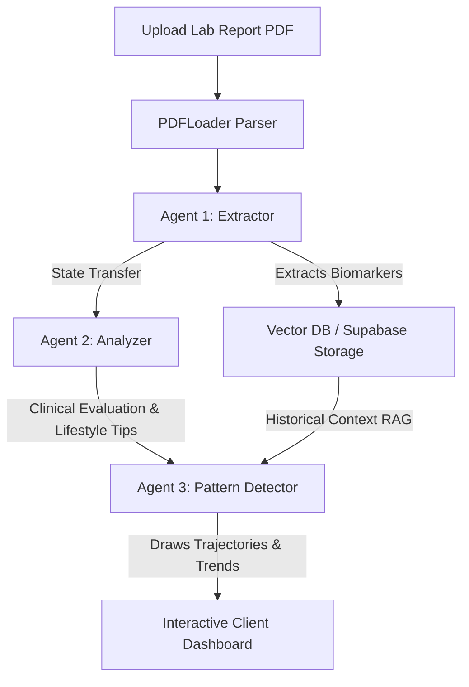

# 🩺 VitalTrace

VitalTrace is an agentic, AI-powered health assistant designed to extract, analyze, and track health trends from diagnostic laboratory reports. Built with Next.js, LangChain, Gemini, and Supabase, it leverages a collaborative 3-agent system to turn messy medical reports into actionable health insights.

---

## 🚀 Key Features

- **Multi-Agent Diagnostics Pipeline**: Orchestrates three distinct LLM agents (Extractor, Analyzer, Pattern Detector) to process reports incrementally.
- **RAG-Powered Trend Tracking**: Employs vector similarity search to map biomarker records historically and detect health trajectories.
- **Physician Consult Guide**: Automatically drafts high-impact questions to help patients prepare for their next clinical visit.
- **Dynamic Actionable Insights**: Recommends personalized lifestyle adjustments (diet, sleep, activity) based on detected biomarker anomalies.
- **Interactive Reports & PDF Export**: Premium dark-mode UI containing trend visualization charts with one-click offline PDF generation.

---

## 🤖 Multi-Agent Architecture

1. **Agent 1: Extractor**: Parses unstructured PDF texts, mapping values to structured biomarkers (Name, Value, Unit, Severity Status). Stores embeddings in Supabase.
2. **Agent 2: Analyzer**: Examines the extracted biomarkers, flags anomalies (high/low/critical), and creates medical briefs along with lifestyle recommendations.
3. **Agent 3: Pattern Detector**: Queries prior records using semantic retrieval, checks historical trajectories, and draws trends (e.g., rising glucose or drops in HbA1c).

---

## 📋 Lab Report Compatibility

### ✅ Works Best (Full Support)
- **Blood / CBC Reports**: Hemoglobin, WBC, RBC, Platelets, Hematocrit.
- **Metabolic Panels**: Fasting Glucose, HbA1c, Creatinine, Electrolytes.
- **Lipid Panels**: Cholesterol, LDL, HDL, Triglycerides.
- **Liver Function (LFT)**: ALT, AST, Bilirubin, Albumin.
- **Thyroid Function (TFT)**: TSH, T3, T4.
- **Kidney Function (KFT)**: Creatinine, BUN, eGFR, Uric Acid.
- **Vitamin Panels**: Vitamin D, B12, Iron, Ferritin.

### ⚠️ Works Partially (Requires Clear Digital Copy)
- **Scanned / Photo PDFs**: Text parsing accuracy drops on low-res scans. (Production recommendation: Integrated OCR using Tesseract.js).

### ❌ Out of Scope
- **Radiology reports** (X-ray, MRI, CT scans)
- **ECG/EEG waveform reports**
- **Handwritten notes** (Can be handled via our voice-to-text input dictation alternative)

---

## 🇮🇳 Major Indian Lab Support Matrix

| Lab | Report Format | Status |
|---|---|---|
| **Dr Lal PathLabs** | Digital PDF | ✅ Fully Supported |
| **Thyrocare** | Digital PDF | ✅ Fully Supported |
| **SRL Diagnostics** | Digital PDF | ✅ Fully Supported |
| **Metropolis** | Digital PDF | ✅ Fully Supported |
| **AIIMS / Govt Labs** | Scanned / Photocopy | ⚠️ Partially Supported |
| **Handwritten Slips** | Paper | ❌ Out of Scope (Use Voice Dictation) |

---

## 🛠️ Tech Stack

- **Framework**: Next.js 14 (App Router)
- **Agent Orchestration**: LangChain, `@langchain/community`
- **Database & Embeddings**: Supabase PostgreSQL + pgvector
- **AI Models**: Google Gemini (`gemini-2-preview` & `gemini-3-flash`)
- **PDF Extraction**: LangChain `PDFLoader` + `pdf-parse` v2
- **PDF Export**: client-side `jsPDF`
- **Styling & UI**: TailwindCSS, Framer Motion, Recharts

---

## 🎯 Project Showcase Pitch (for Resume)

> *"VitalTrace supports any standard diagnostic lab report (CBC, lipid/metabolic/thyroid panels, etc.) from major diagnostic systems like Dr Lal PathLabs and Thyrocare. It orchestrates a 3-agent LLM pipeline to structure biomarkers, identify clinical anomalies, query historical data for trend analysis, and automatically generate doctor briefs and personalized health summaries."*
